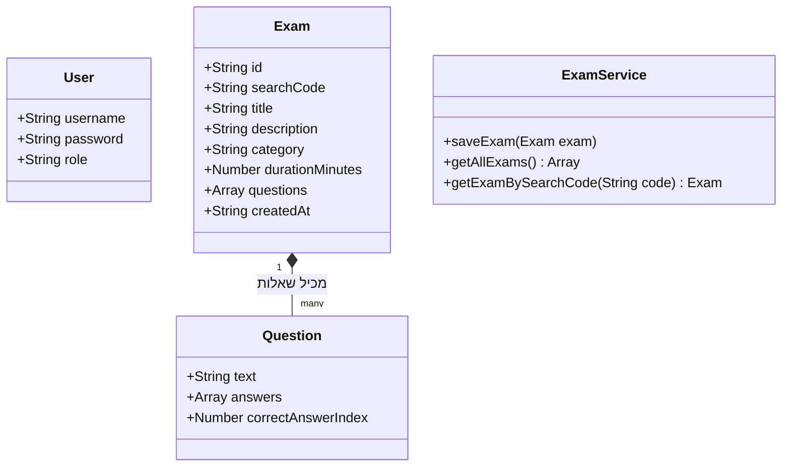

# מסמך טכני: QuizSystemProject

### 1. פרטי הפרויקט וקישורים

* **שם הפרויקט:** QuizSystemProject (מערכת לבנייה וביצוע מבחנים).
* **מפתחות:** כרמן (ת"ז: [הכניסי כאן]) ומלאך (ת"ז: [הכניסי כאן]).
* **טכנולוגיות:** HTML, CSS, JavaScript (ES6 Modules), OOP, JSON, localStorage.
* **קוד מקור ב-GitHub:** https://github.com/karmenmtanes/QuizSystemProject
* **אתר הפרויקט (Deploy):** https://karmenmtanes.github.io/QuizSystemProject/

**הערת ארכיטקטורה:** המערכת שלנו פועלת באופן מלא בצד הלקוח (Client-Side) כ-Single Page Application. כל המידע נשמר באופן מקומי בדפדפן (localStorage) ללא צורך בשרת אחורי (Backend) או מסד נתונים. גישה זו מאפשרת פעולה מהירה וחלקה.

### 2. דפי האתר והניווט

המערכת מורכבת מקובץ `index.html` יחיד. הניווט מתבצע באמצעות קובץ ה-`app.js` שמסתיר ומציג אלמנטים שונים ב-DOM (על ידי הוספה והסרה של מחלקות CSS כמו `d-none`) בהתאם לסטטוס המשתמש והפעולה שהוא מבצע.

| אזור בממשק | הרשאה | תפקיד האזור |
| --- | --- | --- |
| **מסך התחברות / הרשמה** | כולם | הרשמה של משתמש חדש (מורה או סטודנט) או התחברות למערכת. מנוהל על ידי `AuthService`. |
| **אזור מורה (Teacher View)** | מורה בלבד | יצירת מבחן חדש (כולל זמן, קטגוריה ושאלות), צפייה ברשימת המבחנים, וקבלת ה-ID וקוד החיפוש. |
| **אזור סטודנט (Student View)** | סטודנט בלבד | חלון הזנת קוד מבחן (Search Code), מסך ביצוע מבחן עם טיימר, וקבלת ציון מיידי בסיום. |

### 3. פורמט נתונים (JSON) ב-localStorage

המערכת שומרת ושולפת נתונים בפורמט JSON טקסטואלי.

**מפתח: `users` (מערך המשתמשים)**

```json
[
  {
    "username": "karmen_teacher",
    "password": "123",
    "role": "teacher"
  },
  {
    "username": "malak_student",
    "password": "123",
    "role": "student"
  }
]

```

**מפתח: `exams` (מערך המבחנים)**
*כולל את ה-ID הייחודי ואת קוד החיפוש שיצרנו במחלקה `Exam`.*

```json
[
  {
    "id": "c1a4ddce-27a2-45a9-9f8d-273c153f8640",
    "searchCode": "4829",
    "title": "מבחן ב-JavaScript",
    "description": "מבחן מסכם",
    "category": "מדעי המחשב",
    "durationMinutes": 30,
    "questions": [
      {
        "text": "מה זה LocalStorage?",
        "answers": ["שרת", "אחסון בדפדפן", "שפה", "ספרייה"],
        "correctAnswerIndex": 1
      }
    ],
    "createdAt": "2026-07-11T10:00:00.000Z"
  }
]

```

**מפתח: `results` (מערך ציונים ותוצאות)**

```json
[
  {
    "studentUsername": "malak_student",
    "examTitle": "מבחן ב-JavaScript",
    "score": 100
  }
]

```

### 4. מחלקות עיקריות (UML)

המערכת מחולקת לפי עקרונות OOP, עם הפרדה ברורה בין מודלים לבין שירותים וממשק משתמש.



*(תרשים זה יוצג ויזואלית ב-GitHub).*

### 5. Flow מרכזי: הסטודנט מבצע מבחן

1. **חיפוש:** הסטודנט מזין בממשק (StudentUI) את קוד המבחן בן 4 הספרות (`searchCode`).
2. **איתור הנתונים:** ה-`StudentUI` פונה ל-`ExamService` ומפעיל את הפונקציה למציאת המבחן במערך השמור ב-localStorage.
3. **הצגה וטיימר:** המערכת מעלימה את חלון החיפוש, מרנדרת את השאלות אל תוך ה-DOM ומפעילה טיימר שמבוסס על `durationMinutes`.
4. **חישוב:** כאשר הסטודנט מגיש (או הזמן נגמר), הפונקציה ב-UI עוברת על השאלות, משווה את התשובה שנבחרה מול ה-`correctAnswerIndex` של אותה שאלה.
5. **שמירת ציון:** הציון הסופי מחושב באחוזים ונשלח לשמירה ב-localStorage דרך `ResultService`.

### 6. מבנה קבצי הפרויקט

מבנה הקבצים תוכנן בצורה מודולרית (ES Modules), כדי שכל קובץ יהיה אחראי על תחום אחד בלבד.

```text
Exam-Builder-App/
|-- index.html                 # קובץ ה-HTML היחיד של ה-SPA
|-- README.md                  # מסמך טכני ודיאגרמות
|-- css/
|   `-- style.css              # עיצוב מותאם של האפליקציה
`-- js/
    |-- app.js                 # מנהל אירועים גלובליים וניתוב (Routing) בסיסי
    |-- models/                # מחלקות הנתונים (Classes)
    |   |-- Exam.js
    |   |-- Question.js
    |   `-- User.js
    |-- services/              # ניהול נתונים ולוגיקה עסקית (LocalStorage)
    |   |-- AuthService.js
    |   |-- ExamService.js
    |   `-- ResultService.js
    `-- ui/                    # מחלקות לניהול התצוגה וה-DOM
        |-- TeacherUI.js
        |-- StudentUI.js
        `-- ExamUI.js

```
