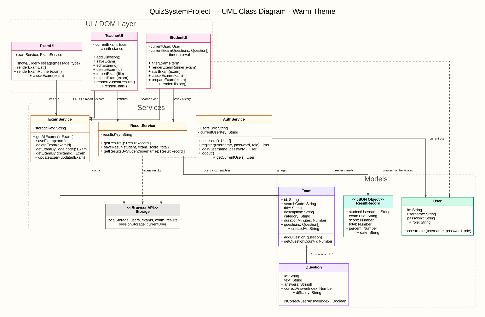
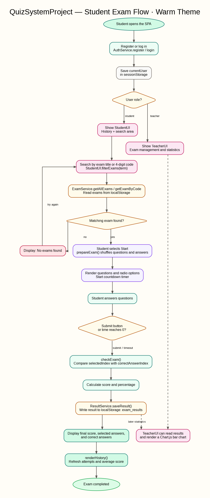

# QuizSystemProject

<div dir="rtl" align="right">

## מערכת לבנייה, ניהול וביצוע מבחנים

**מגישות:**

- **Malak Batheesh — 214659302**
- **Karmen Metanes — 213349343**

מערכת מבחנים מלאה הפועלת בדפדפן כיישום צד־לקוח. מרצה יכול ליצור, לערוך, למחוק, לייבא ולייצא מבחנים; סטודנט יכול לחפש מבחן, לבצע אותו עם טיימר, לקבל ציון ולצפות בהיסטוריית ההישגים שלו.

</div>

<p align="center">
  <a href="https://karmenmtanes.github.io/QuizSystemProject/"><strong>פתיחת האתר</strong></a>
  &nbsp;•&nbsp;
  <a href="https://github.com/karmenmtanes/QuizSystemProject"><strong>קוד המקור ב־GitHub</strong></a>
</p>

---

<div dir="rtl" align="right">

## תוכן עניינים

1. [סקירת הפרויקט](#סקירת-הפרויקט)
2. [טכנולוגיות](#טכנולוגיות)
3. [תפקידי משתמשים וניווט](#תפקידי-משתמשים-וניווט)
4. [פיצ'רים מרכזיים](#פיצרים-מרכזיים)
5. [אחסון ופורמט הנתונים](#אחסון-ופורמט-הנתונים)
6. [תרשים UML](#תרשים-uml)
7. [תרשים Flow](#תרשים-flow)
8. [מבנה הפרויקט](#מבנה-הפרויקט)
9. [הרצה מקומית](#הרצה-מקומית)
10. [הערות ארכיטקטורה ואבטחה](#הערות-ארכיטקטורה-ואבטחה)

## סקירת הפרויקט

`QuizSystemProject` הוא יישום מסוג **Single Page Application**. כל המסכים נמצאים בקובץ `index.html`, והקובץ `js/app.js` מנהל את ההתחברות, את בחירת התצוגה ואת יצירת הממשקים המתאימים למרצה או לסטודנט.

אין בפרויקט שרת Backend ואין מסד נתונים. הנתונים נשמרים בדפדפן באמצעות `localStorage`, והמשתמש המחובר נשמר במהלך ההפעלה באמצעות `sessionStorage`.

## טכנולוגיות

| תחום | טכנולוגיה | שימוש בפרויקט |
|---|---|---|
| מבנה | HTML5 | מסכי התחברות, הרשמה, מרצה וסטודנט |
| עיצוב | CSS3 + Bootstrap 5 | כרטיסים, טפסים, כפתורים ופריסה רספונסיבית |
| לוגיקה | JavaScript ES6 | אירועים, DOM, טיימר וחישוב ציונים |
| ארגון קוד | ES Modules | חלוקה ל־models, services ו־ui |
| תכנון | OOP | מחלקות `User`, `Exam`, `Question` ושירותים |
| שמירת מידע | JSON + localStorage | משתמשים, מבחנים ותוצאות |
| ניהול התחברות | sessionStorage | שמירת `currentUser` עד לסגירת הלשונית |
| גרפים | Chart.js | הצגת ציוני הסטודנטים למרצה |
| פריסה | GitHub Pages | הרצת המערכת כאתר סטטי |

## תפקידי משתמשים וניווט

המערכת מציגה תצוגה שונה בהתאם לערך `role` של המשתמש המחובר.

| מסך / אזור | הרשאה | תפקיד |
|---|---|---|
| התחברות | אורח | אימות שם משתמש וסיסמה דרך `AuthService` |
| הרשמה | אורח | יצירת משתמש מסוג `teacher` או `student` |
| ניווט עליון | משתמש מחובר | הצגת שם המשתמש, מצב כהה והתנתקות |
| ממשק מרצה | מרצה | ניהול מבחנים, ייבוא/ייצוא JSON וסטטיסטיקות |
| ממשק סטודנט | סטודנט | חיפוש מבחנים, ביצוע מבחן והיסטוריית ציונים |
| מבחן פעיל | סטודנט | שאלות, תשובות, טיימר וכפתור הגשה |
| מסך תוצאה | סטודנט | ציון סופי, תשובה שנבחרה והתשובה הנכונה |

## פיצ'רים מרכזיים

### ממשק המרצה

- יצירת מבחן עם שם, תיאור, קטגוריה ומשך זמן.
- הוספת שאלות אמריקאיות עם ארבע תשובות.
- בחירת רמת קושי: `easy`, `medium` או `hard`.
- עריכה ומחיקה של מבחנים קיימים.
- יצוא מבחן לקובץ JSON.
- יבוא מבחן מקובץ JSON ושמירתו כעותק חדש.
- צפייה בתוצאות הסטודנטים.
- הצגת ציונים בגרף עמודות באמצעות Chart.js.

### ממשק הסטודנט

- חיפוש מבחנים לפי שם או קוד בן ארבע ספרות.
- ערבוב סדר השאלות וסדר התשובות לפני תחילת המבחן.
- טיימר ספירה לאחור לפי `durationMinutes`.
- הגשה ידנית או הגשה אוטומטית כאשר הזמן מסתיים.
- חישוב מספר התשובות הנכונות והציון באחוזים.
- הצגת התשובה שנבחרה והתשובה הנכונה לכל שאלה.
- שמירת היסטוריית ניסיונות וחישוב ממוצע כללי.
- מצב כהה / בהיר.

## אחסון ופורמט הנתונים

### מפתחות האחסון

| מפתח | סוג אחסון | תוכן |
|---|---|---|
| `users` | localStorage | מערך המשתמשים הרשומים |
| `exams` | localStorage | מערך המבחנים והשאלות |
| `exam_results` | localStorage | ניסיונות וציוני סטודנטים |
| `currentUser` | sessionStorage | המשתמש המחובר בלשונית הנוכחית |

### משתמש — `User`

```json
{
  "id": "a0cf7e0e-6c67-4a8a-8c9f-c6ef562ac570",
  "username": "malak_student",
  "password": "1234",
  "role": "student"
}
```

`role` יכול להיות `teacher` או `student`. המזהה נוצר באמצעות `crypto.randomUUID()`.

### מבחן — `Exam`

```json
{
  "id": "bf1504ae-09c7-4ca4-845a-5ce3010c6d58",
  "searchCode": "8413",
  "title": "Math Final Exam",
  "description": "מבחן מסכם במתמטיקה",
  "category": "Mathematics",
  "durationMinutes": 10,
  "questions": [
    {
      "id": "528543a8-45fd-48cb-87ca-d07313c16787",
      "text": "36 × 5 = ?",
      "answers": ["90", "300", "150", "180"],
      "correctAnswerIndex": 3,
      "difficulty": "medium"
    }
  ],
  "createdAt": "2026-07-11T10:00:00.000Z"
}
```

`correctAnswerIndex` הוא אינדקס שמתחיל ב־0. בדוגמה, התשובה הרביעית נמצאת באינדקס `3`.

### תוצאה — `ResultRecord`

```json
{
  "studentUsername": "malak_student",
  "examTitle": "Math Final Exam",
  "score": 1,
  "total": 1,
  "percent": 100,
  "date": "11/07/2026, 13:15:30"
}
```

התוצאה נשמרת על ידי `ResultService.saveResult()`. השירות גם מסנן תוצאות של מבחנים שכבר נמחקו.

## תרשים UML

התרשים מציג את שכבת המודלים, השירותים, ממשקי ה־DOM והקשרים ביניהם.

</div>



<div dir="rtl" align="right">

### קשרים מרכזיים

- `Exam` מכיל מערך של אובייקטי `Question`.
- `AuthService` יוצר ומאמת משתמשים ושומר את מצב ההתחברות.
- `ExamService` אחראי על שמירה, שליפה, עדכון ומחיקה של מבחנים.
- `ResultService` שומר תוצאות ומחזיר היסטוריה לפי סטודנט.
- `TeacherUI`, `StudentUI` ו־`ExamUI` מנהלים את התצוגה ומפעילים את השירותים.

## תרשים Flow

התרשים מציג את התהליך המרכזי מרגע פתיחת המערכת ועד לשמירת הציון והצגתו.

</div>



<div dir="rtl" align="right">

### תיאור התהליך

1. המשתמש נרשם או מתחבר דרך `AuthService`.
2. התפקיד קובע אם יוצג ממשק מרצה או ממשק סטודנט.
3. הסטודנט מחפש מבחן לפי שם או קוד.
4. `ExamService` קורא את המבחנים מ־`localStorage`.
5. לפני ההצגה, `StudentUI.prepareExam()` מערבבת שאלות ותשובות ומעדכנת את אינדקס התשובה הנכונה.
6. המבחן מוצג והטיימר מתחיל.
7. בלחיצה על הגשה או בסיום הזמן, `checkExam()` בודקת את התשובות.
8. `ResultService` שומר את התוצאה במפתח `exam_results`.
9. הסטודנט מקבל ציון, פירוט תשובות והיסטוריה מעודכנת.
10. המרצה יכול לצפות בתוצאה ובגרף הציונים.

## מבנה הפרויקט

</div>

```text
QuizSystemProject/
|-- index.html                  # כל מסכי ה-SPA והטעינה של app.js
|-- README.md                   # תיעוד הפרויקט והדיאגרמות
|-- css/
|   `-- style.css               # עיצוב מותאם אישית
|-- docs/
|   |-- uml-diagram.png
|   `-- student-exam-flow.png
`-- js/
    |-- app.js                  # אתחול, ניווט, אירועים וחיבור השירותים
    |-- models/
    |   |-- User.js
    |   |-- Exam.js
    |   `-- Question.js
    |-- services/
    |   |-- AuthService.js
    |   |-- ExamService.js
    |   `-- ResultService.js
    `-- ui/
        |-- TeacherUI.js
        |-- StudentUI.js
        `-- ExamUI.js
```

<div dir="rtl" align="right">

## הרצה מקומית

מכיוון שהפרויקט משתמש ב־ES Modules, מומלץ להריץ אותו דרך שרת HTTP מקומי ולא באמצעות פתיחת `index.html` ישירות.

### אפשרות 1 — VS Code Live Server

1. פותחים את תיקיית הפרויקט ב־VS Code.
2. מתקינים את ההרחבה **Live Server**.
3. לוחצים לחיצה ימנית על `index.html`.
4. בוחרים **Open with Live Server**.

### אפשרות 2 — Python

```bash
python -m http.server 8000
```

לאחר מכן פותחים בדפדפן:

```text
http://localhost:8000
```

### משתמשי הדגמה

| תפקיד | שם משתמש | סיסמה |
|---|---|---|
| מרצה | `karmen_teacher` | `123` |
| סטודנט | `malak_student` | `123` |

> ייתכן שקיימת גרסה נוספת של ערכי ברירת המחדל בקובץ `AuthService.js`. בפועל `app.js` יוצר את המשתמשים רק כאשר המפתח `users` עדיין אינו קיים.

## הערות ארכיטקטורה ואבטחה

- הפרויקט פועל כולו בצד הלקוח ואינו משתמש ב־API או במסד נתונים.
- `app.js` משמש כ־composition root: הוא יוצר את השירותים ומעביר אותם למחלקות ה־UI.
- `ExamService.getAllExams()` משחזר אובייקטים מסוג `Exam` ו־`Question` לאחר קריאת JSON.
- המערכת משתמשת ב־event delegation בממשק המרצה.
- התוצאות מקושרות למבחן לפי `examTitle`, ולא לפי `examId`.
- הסיסמאות נשמרות כטקסט רגיל. זה מתאים להדגמה לימודית בלבד; במערכת אמיתית יש לבצע אימות בצד שרת ולשמור password hash.
- הנתונים מקומיים לדפדפן ולמכשיר. ניקוי נתוני האתר ימחק משתמשים, מבחנים ותוצאות.

## מפתחות הפרויקט

- **Malak Batheesh — 214659302**
- **Karmen Metanes — 213349343**

</div>
